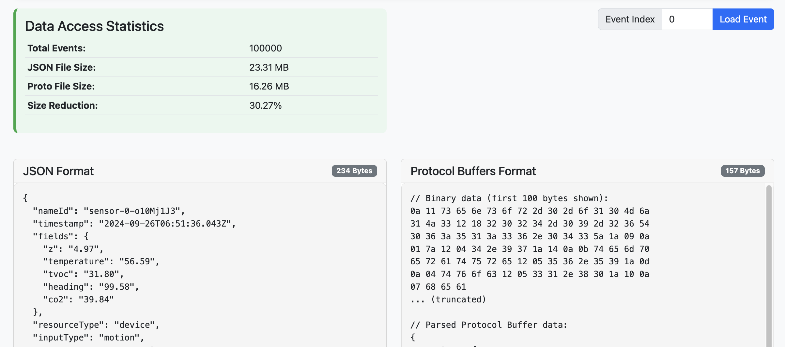

# JSON vs Protocol Buffers Benchmark

This project provides a comprehensive benchmark comparing JSON and Protocol Buffers for sensor event data. It includes a fully functional Node.js/TypeScript API with Express and Kafka integration, alongside benchmarking tools to evaluate serialization, deserialization, and storage efficiency.

## Project Overview

The project demonstrates how to:

1. Set up a Node.js project with TypeScript, Express, Kafka, and Protocol Buffers
2. Define Protocol Buffer schema for sensor event data
3. Create services for handling both formats
4. Generate large datasets for comparison
5. Benchmark serialization, deserialization, and storage performance
6. Visualize benchmark results
7. Explore and interact with the data in both formats

## Benchmark Results

Below is a sample visualization of the benchmark results:



## Proto Definition

We're using this Protocol Buffer definition for our sensor events:

```protobuf
syntax = "proto3";
package sensor;

// A truly dynamic map of string→string.
message Event {
  string nameId       = 1;
  string timestamp    = 2;
  map<string, string> fields      = 3;
  string resourceType = 4;
  string inputType    = 5;
  string projectId    = 6;
}
```

## Project Structure

```
sensor-event-api/
├── package.json        # Project dependencies and scripts
├── tsconfig.json       # TypeScript configuration
├── src/
│   ├── index.ts        # Main API application
│   ├── benchmark.ts    # Benchmark script
│   ├── visualization.ts # Visualization generator
│   ├── explorer.ts     # Interactive data explorer
│   ├── proto/
│   │   └── sensor.proto # Protocol Buffers definition
│   ├── services/
│   │   ├── kafka.service.ts # Kafka service
│   │   └── proto.service.ts # Protocol Buffers service
│   └── routes/
│       └── events.routes.ts # API routes
├── output/             # Generated benchmark output
│   ├── events.json     # JSON dataset
│   ├── events.proto.bin # Protocol Buffers dataset
│   ├── comparison-report.md # Markdown report
│   └── comparison-final.html # HTML visualization
└── docker-compose.yml  # Kafka setup
```

## Installation

1. Clone the repository:

```bash
git clone <repository-url>
cd sensor-event-api
```

2. Install dependencies:

```bash
yarn install
# or
npm install
```

3. Install Protocol Buffers CLI (if not installed):

```bash
yarn add -g protobufjs-cli
# or
npm install -g protobufjs-cli
```

4. Generate JavaScript/TypeScript from Proto files:

```bash
yarn generate-proto
# or
npm run generate-proto
```

## Running the API

1. Start Kafka (requires Docker):

```bash
docker-compose up -d
```

2. Start the API in development mode:

```bash
yarn dev
# or
npm run dev
```

3. For production:

```bash
yarn build
yarn start
# or
npm run build
npm start
```

## Running the Benchmark

To run the complete benchmark:

```bash
yarn benchmark
# or
npm run benchmark
```

This will:
1. Generate 100,000 random sensor events
2. Serialize them to both JSON and Protocol Buffers
3. Compare serialization/deserialization time and file size
4. Generate detailed reports and visualizations

### Individual Benchmark Steps

You can also run individual parts of the benchmark:

```bash
# Just generate the data and benchmark
yarn benchmark:gen

# Just create/update visualizations
yarn benchmark:viz
```

## Data Explorer

After running the benchmark, you can explore the data in both formats using the interactive explorer:

```bash
yarn explorer
# or
npm run explorer
```

Then open your browser to http://localhost:3001.

The explorer allows you to:
- View specific events in both JSON and Protocol Buffers formats
- Compare sizes and serialization format
- Browse the benchmark results

## Key Benefits of Protocol Buffers

Based on benchmark results, Protocol Buffers typically offer:

1. **Size Efficiency**: 30-60% smaller than equivalent JSON
2. **Performance**: Faster serialization and deserialization
3. **Schema Validation**: Type safety and validation through schema
4. **Language Agnostic**: Compatible with multiple programming languages

## Notes on Kafka Integration

This project includes a Kafka integration service that:
1. Connects to a Kafka broker
2. Publishes Protocol Buffer encoded events
3. Subscribes to events and decodes them
4. Provides a clean API for Kafka operations

## Contributing

Contributions are welcome! Please feel free to submit a Pull Request.

## License

This project is licensed under the MIT License - see the LICENSE file for details.